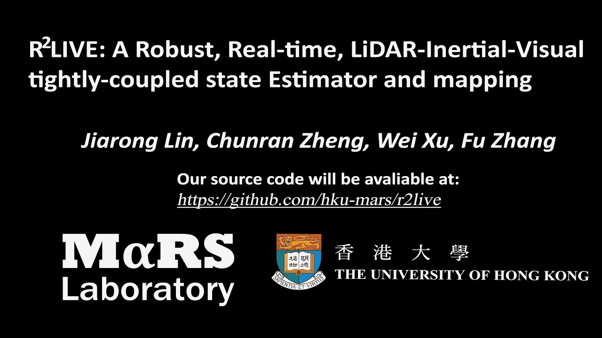
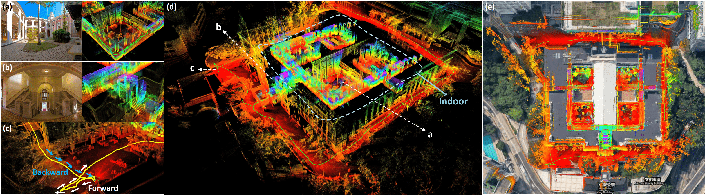
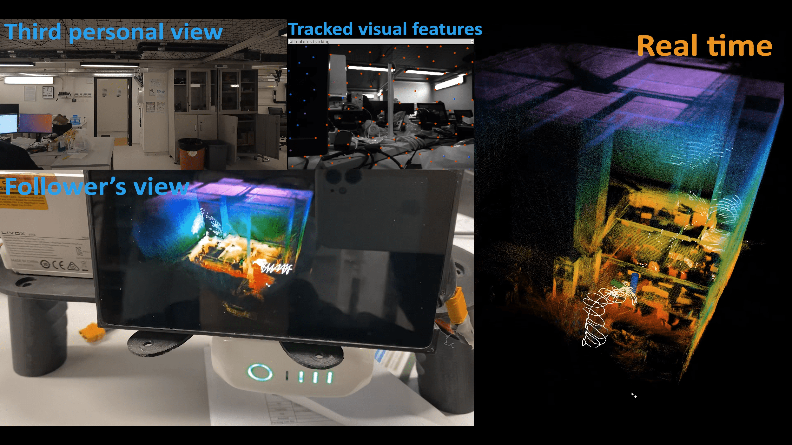
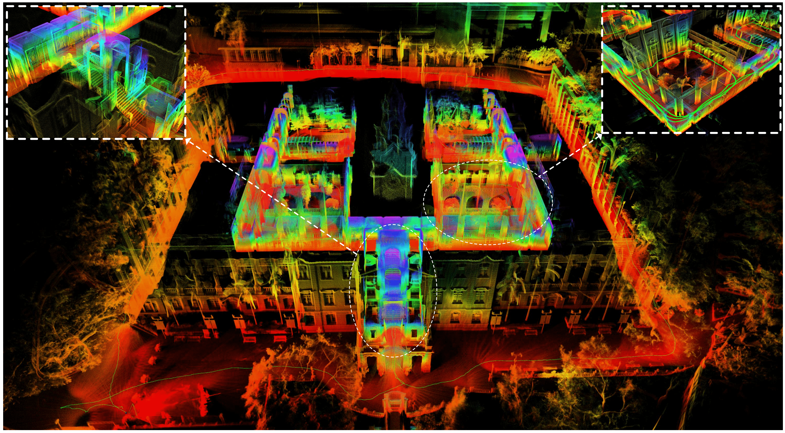

# R2LIVE
## A Robust, Real-time, LiDAR-Inertial-Visual tightly-coupled state Estimator and mapping

**Our preprint paper**: we have corrected some typos and errors of our previous version of paper, the amended paper can be access at [here](paper/r2live_ral_final.pdf). When amending our paper, I would like to thanks [narutojxl (焦小亮)](https://github.com/narutojxl), who has found my errors and provided his corrections.
 
**Our related video**: our related video is now available on YouTube (click below images to open):
<div align="center">
<a href="https://www.youtube.com/watch?v=9lqRHmlN_MA" target="_blank"></a>
</div>

**R2LIVE** is a robust, real-time tightly-coupled multi-sensor fusion framework, which fuses the measurement from the LiDAR, inertial sensor, visual camera to achieve robust, accurate state estimation. Taking advantage of measurement from all individual sensors, our algorithm is robust enough to various visual failure, LiDAR-degenerated scenarios, and is able to run in real time on an on-board computation platform, as shown by extensive experiments conducted in indoor, outdoor, and mixed environment of different scale.

<div align="center">
    
    <font color=#a0a0a0 size=2>The reconstructed 3D maps of HKU main building are shown in (d), and the detail point cloud with the correspondence panorama images are shown in (a) and (b). (c) shows that our algorithm can close the loop by itself (returning the starting point) without any additional processing (e.g. loop closure). In (e), we merge our map with the satellite image to further examine the accuracy of our system.</font>
</div>

## 1. Prerequisites
### 1.1 **Ubuntu** and **ROS**
Ubuntu 64-bit 16.04 or 18.04.
ROS Kinetic or Melodic. [ROS Installation](http://wiki.ros.org/ROS/Installation) and its additional ROS pacakge:

```
    sudo apt-get install ros-XXX-cv-bridge ros-XXX-tf ros-XXX-message-filters ros-XXX-image-transport
```
**NOTICE:** remember to replace "XXX" on above command as your ROS distributions, for example, if your use ROS-kinetic, the command should be:

```
    sudo apt-get install ros-kinetic-cv-bridge ros-kinetic-tf ros-kinetic-message-filters ros-kinetic-image-transport
```

### 1.2. **Ceres Solver**
Follow [Ceres Installation](http://ceres-solver.org/installation.html).

### 1.3. **livox_ros_driver**
Follow [livox_ros_driver Installation](https://github.com/Livox-SDK/livox_ros_driver).

## 2. Build r2live on ROS:
Clone the repository and catkin_make:

```
    cd ~/catkin_ws/src
    git clone https://github.com/hku-mars/r2live.git
    cd ../
    catkin_make
    source ~/catkin_ws/devel/setup.bash
```

## 3. Docker Support (optional)
To further facilitate the building process, we add docker in our code. Docker environment is like a sandbox, thus makes our code environment-independent. 

Docker build

```
    docker/build
```
Run 

```
    xhost +
    docker/run
```

Run with gpu support

```
    xhost +
    docker/run_gpu
``` 

## 4. Run our examples
Download [Our recorded rosbag](https://drive.google.com/drive/folders/1LpoX6_05Zic-mRLOD38EO0w2ABXI1rrW?usp=sharing) and then
```
roslaunch r2live demo.launch
rosbag play YOUR_DOWNLOADED.bag
```
If everything is correct, you will get the result that matches our paper:)
The result of [indoor_aggressive.bag](https://drive.google.com/file/d/1UwEna7S6Unm0RuGcSZhUkEstNsbJaMjX/view?usp=sharing) (the Experiment-1 in our [paper](paper/r2live_ral_final.pdf)):
<div align="center">
    
</div>

and [hku_main_building.bag](https://drive.google.com/file/d/1cwCuUYkUwL4ch_oloAoUMfL-G1MHTdMk/view?usp=sharing) (our Experiment-3).
<div align="center">
    
</div>

## 5. Sampling and run your own data
Since the LiDAR data and IMU data published by the official Livox-ros-driver is with the timestamp of LiDAR (started from 0 in each recording), and the timestamp of the image is usually recorded with the timestamp of the operation system. To make them working under the same time-based, we modified the source code of Livox-ros-driver, which is available at [here](https://github.com/ziv-lin/livox_ros_driver_for_R2LIVE). We suggest you replace the official driver with it when sampling your own data for R2LIVE.

## 6. Acknowledgments
Our repository contains two main subsystems, with our LiDAR-inertial and visual-inertial system is developed based on [FAST-LIO](https://github.com/hku-mars/FAST_LIO) and [VINS-Mono](https://github.com/HKUST-Aerial-Robotics/VINS-Mono), respectively. Besides, our implementations also use the codes of [ikd-Tree](https://github.com/hku-mars/ikd-Tree), [BALM](https://github.com/hku-mars/BALM) and [loam-livox](https://github.com/hku-mars/loam_livox).


## 7. License
The source code is released under [GPLv2](http://www.gnu.org/licenses/) license.

We are still working on improving the performance and reliability of our codes. For any technical issues, please contact me via email Jiarong Lin < ziv.lin.ljr@gmail.com >.

For commercial use, please contact Dr. Fu Zhang < fuzhang@hku.hk >
