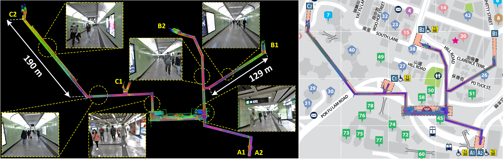

# R2LIVE
## A Robust, Real-time, LiDAR-Inertial-Visual tightly-coupled state Estimator and mapping

## Update (April 3 2021)

**Date of releasing our source code**:
Currently, our paper is under review, and our code is under-reconstruction. We will release our source code after the first round of review if the reviewer's comments are positive.

**Our preprint paper**: we have corrected some typos and errors of our previous version of paper, the amended paper can be access at [here](paper/R2LIVE_amended_v1.pdf). When amending our paper, I would like to thanks [narutojxl (焦小亮)](https://github.com/narutojxl), who has found my errors and provided his corrections.
 
**Our related video**: our related video is now available on YouTube (click below images to open):

**R2LIVE** is a robust, real-time tightly-coupled multi-sensor fusion framework, which fuses the measurement from the LiDAR, inertial sensor, visual camera to achieve robust, accurate state estimation. Taking advantage of measurement from all individual sensors, our algorithm is robust enough to various visual failure, LiDAR-degenerated scenarios, and is able to run in real time on an on-board computation platform, as shown by extensive experiments conducted in indoor, outdoor, and mixed environment of different scale.

    
    The reconstructed 3D maps of HKU main building are shown in (d), and the detail point cloud with the correspondence panorama images are shown in (a) and (b). (c) shows that our algorithm can close the loop by itself (returning the starting point) without any additional processing (e.g. loop closure). In (e), we merge our map with the satellite image to further examine the accuracy of our system.

    
    We evaluate our algorithm in a Hong Kong MTR station consisting of cluttered lobby and very long narrow tunnels, as shown in (a). The tunnel is up to 190 meters long and is filled with moving pedestrians, making it extremely challenging for both LiDAR-based and camera-based SLAM methods. (b): the map built by our system is well aligned with the street map of the MTR station.

